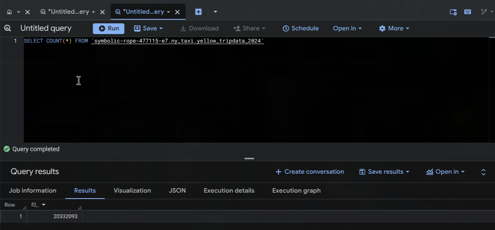
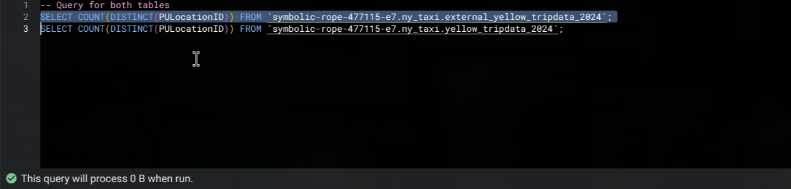
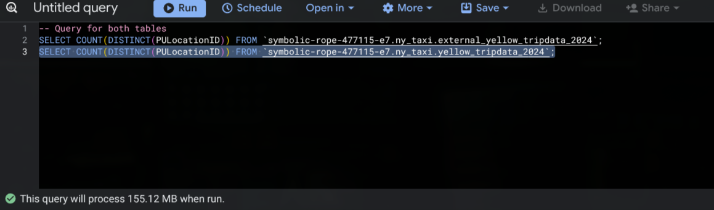
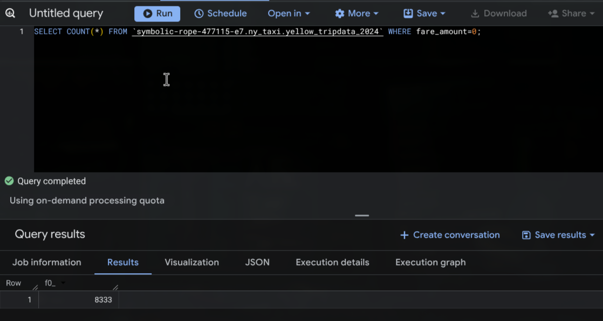
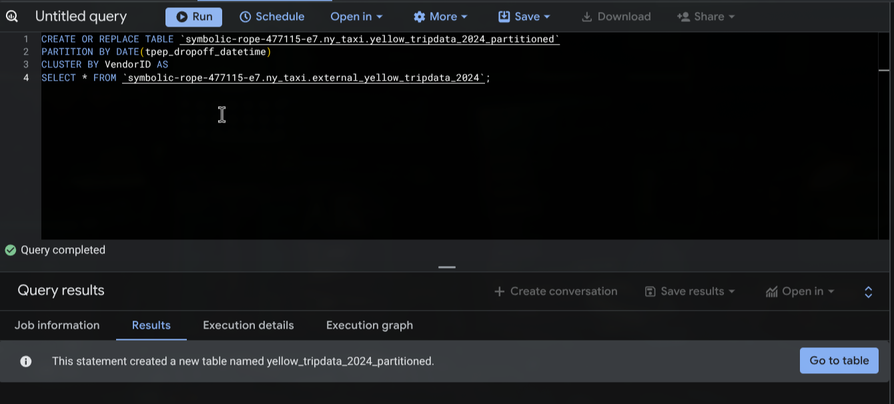
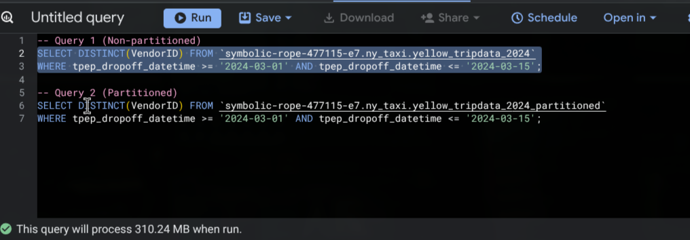
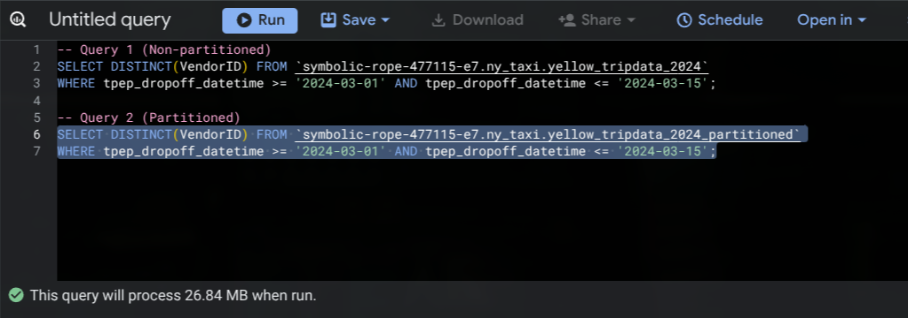

# BigQuery Homework – Module 3

This homework practices working with BigQuery and Google Cloud Storage.  
screenshots for each answer are in the [`screenshots`](./screenshots) folder.
## Setup
1. **GCS Bucket:** Uploaded 6 Parquet files for January 2024 - June 2024 using load_yellow_taxi_data.py.
2. **External Table:** Created `external_yellow_tripdata_2024` pointing to the GCS bucket.
3. **Native Table:** Created `yellow_tripdata_2024` by selecting all data from the external table.
---

## Table of Contents

- [Question 1 – Counting Records](#question-1--counting-records)
- [Question 2 – Data Read Estimation](#question-2--data-read-estimation)
- [Question 3 – Columnar Storage](#question-3--columnar-storage)
- [Question 4 – Zero Fare Trips](#question-4--zero-fare-trips)
- [Question 5 – Partitioning and Clustering](#question-5--partitioning-and-clustering)
- [Question 6 – Partition Benefits](#question-6--partition-benefits)
- [Question 7 – External Table Storage](#question-7--external-table-storage)
- [Question 8 – Clustering Best Practices](#question-8--clustering-best-practices)
- [Question 9 – Understanding Table Scans](#question-9--understanding-table-scans)

---

## Question 1 – Counting Records

**Query:**

```sql
SELECT COUNT(*)
FROM `symbolic-rope-477115-e7.ny_taxi.yellow_tripdata_2024`;
```

**Answer:** 20,332,093

**Screenshot:**



---

## Question 2 – Data Read Estimation

**Queries:**

```sql
-- External Table (Estimated 0 B)
SELECT COUNT(DISTINCT PULocationID)
FROM `symbolic-rope-477115-e7.ny_taxi.external_yellow_tripdata_2024`;

-- Native Table (Estimated 155.12 MB)
SELECT COUNT(DISTINCT PULocationID)
FROM `symbolic-rope-477115-e7.ny_taxi.yellow_tripdata_2024`;
```

**Answer:** 0 MB for the External Table and 155.12 MB for the Materialized Table

**screenshots:**




---

## Question 3 – Columnar Storage

**Answer:** BigQuery is a columnar database and only scans the specific columns requested. Querying two columns (`PULocationID`, `DOLocationID`) requires reading more data than querying one column (`PULocationID`), leading to a higher estimated number of bytes processed.

> No screenshot required for this conceptual question.

---

## Question 4 – Zero Fare Trips

**Query:**

```sql
SELECT COUNT(*)
FROM `symbolic-rope-477115-e7.ny_taxi.yellow_tripdata_2024`
WHERE fare_amount = 0;
```

**Answer:** 8,333

**Screenshot:**



---

## Question 5 – Partitioning and Clustering

**Query:**

```sql
CREATE OR REPLACE TABLE `symbolic-rope-477115-e7.ny_taxi.yellow_tripdata_2024_partitioned`
PARTITION BY DATE(tpep_dropoff_datetime)
CLUSTER BY VendorID AS
SELECT *
FROM `symbolic-rope-477115-e7.ny_taxi.external_yellow_tripdata_2024`;
```

**Answer:** Partition by `tpep_dropoff_datetime` and Cluster on `VendorID`

**Screenshot:**



---

## Question 6 – Partition Benefits

**Queries:**

```sql
-- Non-partitioned table (310.24 MB)
SELECT DISTINCT VendorID
FROM `symbolic-rope-477115-e7.ny_taxi.yellow_tripdata_2024`
WHERE tpep_dropoff_datetime BETWEEN '2024-03-01' AND '2024-03-15';

-- Partitioned table (26.84 MB)
SELECT DISTINCT VendorID
FROM `symbolic-rope-477115-e7.ny_taxi.yellow_tripdata_2024_partitioned`
WHERE tpep_dropoff_datetime BETWEEN '2024-03-01' AND '2024-03-15';
```

**Answer:** 310.24 MB for the non-partitioned table and 26.84 MB for the partitioned table

**screenshots:**




---

## Question 7 – External Table Storage

**Answer:** GCP Bucket

---

## Question 8 – Clustering Best Practices

**Answer:** False

---

## Question 9 – Understanding Table Scans

**Answer:** 0 Bytes. BigQuery stores row counts in the table metadata for native tables, so it does not need to scan the actual data to return the total count.